## How to use the Transcript Editor panel

Once a Project with a Transcript is created or opened, with an [attached media file](media-manager.md), then you can immediately type in the Transcript Editor.

Watch the [basic](https://www.youtube.com/watch?v=dqEehi8Jaa0) and [advanced](https://www.youtube.com/watch?v=U3yPPHZ-yak) video tutorials on YouTube.

### Buttons on the bar at the top of the Editor

There are six clusters of buttons at the top of the Transcript Editor panel.

[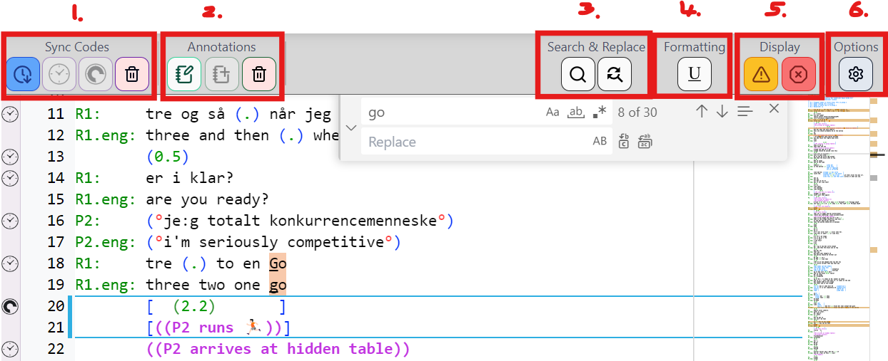](images/transcript/editor.png)

#### The first cluster is for Sync-codes

[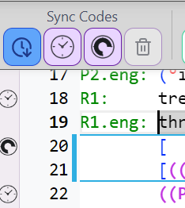](images/transcript/sync-code-buttons.png)

- The first button is `Show/hide highlight of current sync-code block` (CS) mode, in which the current transcript segment in the editor between adjacent [sync-codes](sync-code.md) will be highlighted or not as the video plays.
The transcript will be automatically scrolled to keep the current segment visible as the video plays.
    - The mode can be toggled on/off using the button at the top right of the Editor panel.
- The second button is `Add sync-code` on current line.
- The third button is `Add ranged sync-code` on current line.
- The fourth button is `Delete sync-code`.
It is only available when the current line has a sync-code attached.

#### The second cluster is for annotations

[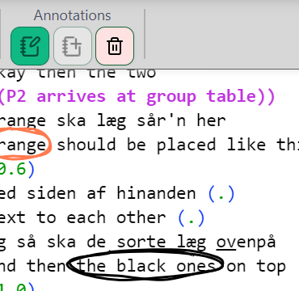](images/transcript/annotation-buttons.png)

- The first button is `Show/Hide Transcript Clip`, which will show or hide all Clips in the current Transcript in the Editor.
- The second button is `Add Transcript Clip` to currently selected text.
It is only highlighted when text is selected in the Editor.
- The third button is `Delete Transcript Clip`.
It will only work when a Transcript Clip is present at the current location of the cursor.

#### The third cluster is for Search & Replace

[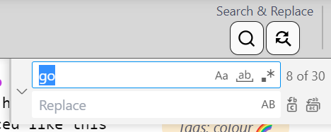](images/transcript/search-buttons.png)

- The first button is `Open Find panel`.
- The second button is `Open Find/Replace panel`.

#### The fourth cluster is for formatting text

The underline button is for adding and removing underlines to selected text. - Select some text and click the button.

The other button is to manually trigger a context-menu at the cursor position in the transcript. Normally this menu can be triggered at any time by pressing [ <kbd>CTRL</kbd> + <kbd>ENTER</kbd> ] OR [ <kbd>⌘</kbd> + <kbd>ENTER</kbd>]
This menu provides quick access to common / relevant symbols for the cursors position in the transcript.

#### The fifth cluster is for display of errors and warnings

[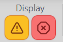](images/transcript/error-buttons.png)

- The first button is `Show/Hide Warnings` in the Editor.
- The second button is `Show/Hide Errors`.

#### The sixth cluster is for Transcript options

There is only one button ⚙️ that opens Transcript options.

### Line numbers

- Line numbers appear automatically in _DOTE_, but they are not saved in the _transcript.txt_ file.
[Transcripts are exportable](export.md) with fixed line numbers in specific styles.
- If one selects text, then all instances of the same text are highlighted in the whole transcript.

[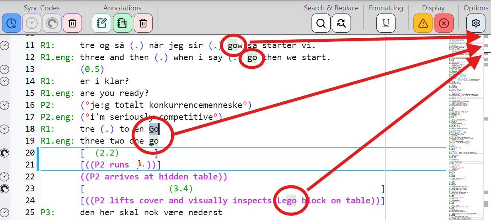](images/transcript/minimap2.png)

### Scroll bar and minimap

The scroll bar shows a _minimap_ of where the other instances of the currently selected text or [FIND](find.md) matches are located in the whole transcript. Neat! 😇

[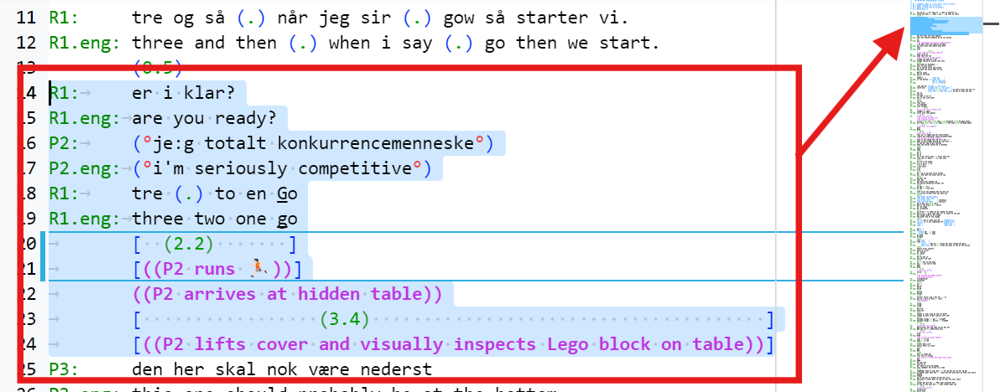](images/transcript/minimap.png)

### Margin indicator 

If you would like a gentle reminder of a specific right margin that the body of the transcript should not exceed, then turn on the margin indicator in [Transcript Options](settings.md#options).
A gray vertical line will appear in the Transcript editor panel.
A specific character width can be set.
The default is 70 characters, but that can be changed for all new Transcripts in [Settings](settings.md).
It can be turned off for all new Transcripts as well.
The margin indicator option for each Transcript overrides the default setting.
The indicator is just a guide; _DOTE_ does not enforce word wrapping.

### Transcript font 

A standard monospaced font is used in the Editor panel.
This cannot be changed.
It is required to enable vertical alignment across lines to be supported.
On [exporting to RTF](export.md), a monospaced font is also used in order to preserve layout.
The font can then be changed in a Word processor (to another monospaced font such as "Consolas").
The size of the transcript font in the editor can be changed by default in [Settings](settings.md) or changed locally for a Transcript in [Transcript Options](settings.md#options).
Note that emojis are not monospaced, so using them will disrupt vertical alignment.

### Using the Editor with a set of conventions

DOTE instantiates a specific set of rules embodied in the two sets of [transcriptions conventions](conventions.md).
They have much in common, but there are key differences with respect to multimodality.

#### Speaker-ids 

- Speaker-ids should appear at the beginning of the line followed by a colon <kbd>:</kbd> and then a single <kbd>TAB</kbd>.
Once one enters one or more speaker designations, then _DOTE_ will prompt you with a list as you type a new line.
If one types <kbd>CTRL</kbd>+<kbd>ENTER</kbd> or <kbd>⌘</kbd>+<kbd>ENTER</kbd> before typing, then a drop-down list of all known speakers + known and default named subtier types will appear.

[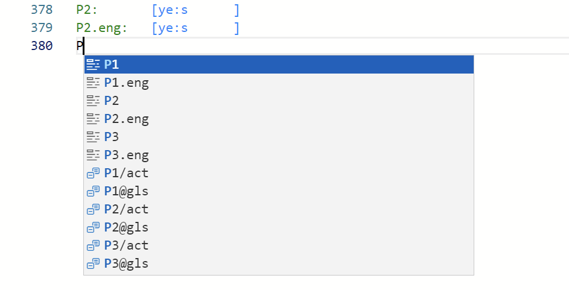](images/transcript/id.png)

This list can get quite long if you have many speakers and many subtier type instances.
- If a speaker-id is long, then the default id column width can be changed in [Settings](settings.md).
_DOTE_ will warn you when the speaker designation + named subtier type is too long for the designated column width.
The default is 8 characters, which is good for short speaker-ids, eg. "ART".

[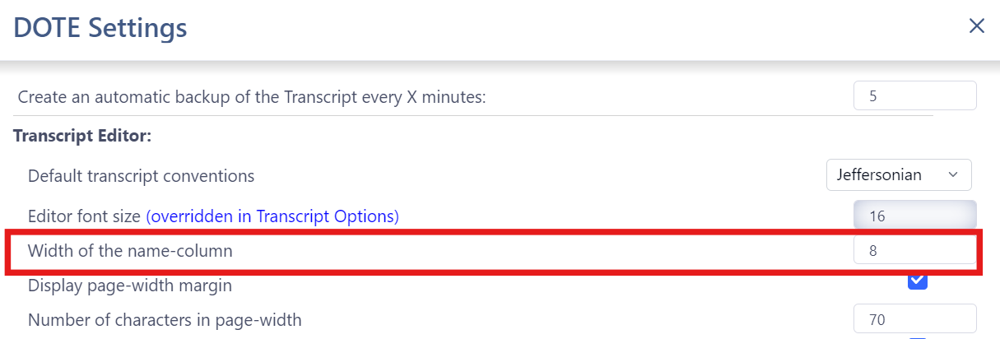](images/transcript/id-settings.png)

The name column width can also be changed in each Transcript.

[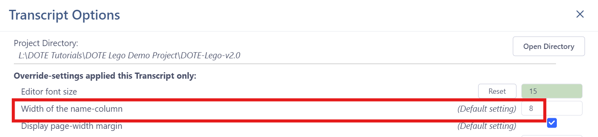](images/transcript/id-options.png)

#### Language subtier type

- Language [subtier types](tiers.md) for translations can be set in [Transcript Options](settings.md#options).

[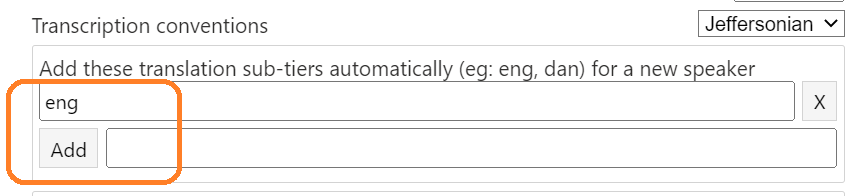](images/transcript/types.png)

Just add a three-letter code for each extra language subtier (eg. _eng_).
    - Although the usage of ISO 639-2 language codes is strongly advised, it is not enforced.
    See the [complete list of such language codes](https://www.loc.gov/standards/iso639-2/php/code_list.php).

Other subtier types can be defined, eg. interlinear gloss and [action subtiers](tiers.md).

#### TAB, SPACE and LINE BREAK

Watch the [video tutorial](https://www.youtube.com/watch?v=vJf6e4Birhg) on YouTube.

- After a speaker name, there should _always_ be a <kbd>TAB</kbd>, followed by the transcription text for that speaker.
- Do the same for speaker continuation on new lines and for lines with pauses or comments.

[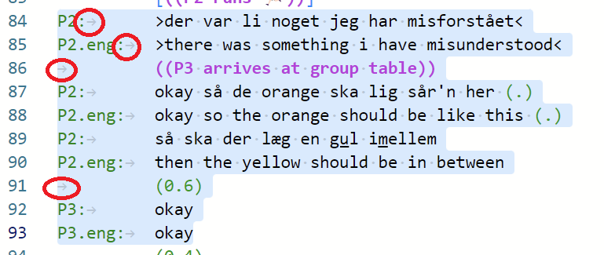](images/transcript/tabs.png)

- _Never_ use <kbd>TAB</kbd> in the body of the transcript.
Use <kbd>SPACE</kbd> instead to create whitespace in the body of the transcript; otherwise, the layout, auto-formatting and transcript heuristics will not work.
- There is no automatic line wrapping, so remember to break your lines.
A notional margin indicator can be set as a default in [Settings](settings.md) and for each transcript in [Transcript Options](settings.md#options).

#### Overlap alignment help 

- With its transcript heuristics, _DOTE_ offers help with overlaps, such as `[  ]` or `{  }`, and vertical syncing of overlaps across lines and sub-tiers.
    - _DOTE_ will show a light bulb adjacent to the current line if such help is available at the cursor's location.
    Clicking on that light bulb will provide an option to automatically align overlaps across multiple lines and sub-tiers.
    You can also use the shortcut <kbd>CTRL</kbd>+<kbd>.</kbd> or <kbd>⌘</kbd>+<kbd>.</kbd> to open up the fix menu.
    Note that in some more extreme, complex cases the alignment fix will be incorrect.
    This is a hard problem, so more development is necessary to solve all cases.
- To get context specific help, then use the shortcut <kbd>CTRL</kbd>+<kbd>ENTER</kbd> or <kbd>⌘</kbd>+<kbd>ENTER</kbd>.

#### Autocompletion 

Watch the [video tutorial](https://www.youtube.com/watch?v=-8s8c1pVeLQ) on YouTube.

- If your cursor is in the speaker name column, then as you type a list of known and default speaker + named subtier types will appear in a drop-down list.

[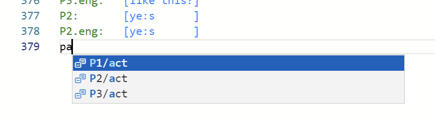](images/transcript/autocomplete1.png)

- If your cursor is in the body of the transcript, then <kbd>CTRL</kbd>+<kbd>ENTER</kbd> (or <kbd>⌘</kbd>+<kbd>ENTER</kbd> on macOS) will display a drop-down list of choices for autocompletion will appear.
These include a range of [single and paired symbols](jefferson.md).

[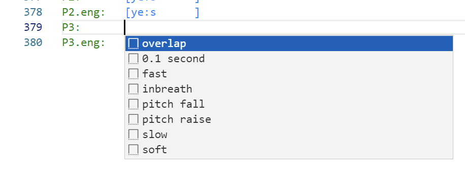](images/transcript/autocomplete2.png)

You can also type the first letter (and second) in the transcript body and a list will appear with a selection matching the letter(s), eg. type <kbd>p</kbd> and a list of pitch related symbols will appear.
- Some types of paired transcription symbols are automatically completed and highlighted, eg. `(( ))` or `< >` or `{ }`.

There are two special cases of autocompletion that are non-standard:

1. Non-sequential simultaneous overlap `{...}`.
This indicates that two or more speakers are speaking at the same time, but they are not in the same conversation.
The simultaneous speech or sounds are marked just as with the more conventional usage of `[...]`.
1. 0.1 second symbol `◘`.
This symbol indicates the passing of 0.1 seconds, eg. `◘◘◘◘◘` = 0.5 seconds.
It is especially useful in the [Mondadaian system](mondada.md) for marking [timing interval tiers](mondada.md) instead of the more conventional non-proportional pause indications, eg. `(0.1)`.

More fixed symbols and pairs will be added in later releases, as well as a user-configurable set of autocompleteable symbols/pairs.

### Where is the edited Transcript stored?

- The raw transcript text is saved in the `transcript.txt` file in the Transcript folder that you created within the parent [Project](projects.md) folder.
It can be opened or copied in a word processor and formatted accordingly. However underlining is not present in the plain text file, and exporting your transcript to [RTF format](exportRTF.md) is highly recommended for opening your transcript in a standard word processor.

### Creating and editing Transcript Clips with Annotations

[Transcript Clips](transcript-clip.md) with annotations, tags and styling can be created, edited and deleted by selecting a chunk of text in the currently loaded Transcript.

### Other commands and shortcuts

There are more complex editing commands available that you can explore, such as multicursor, change all occurrences or search/replace.

A [complete list of commands and shortcuts](commands.md) is available.
