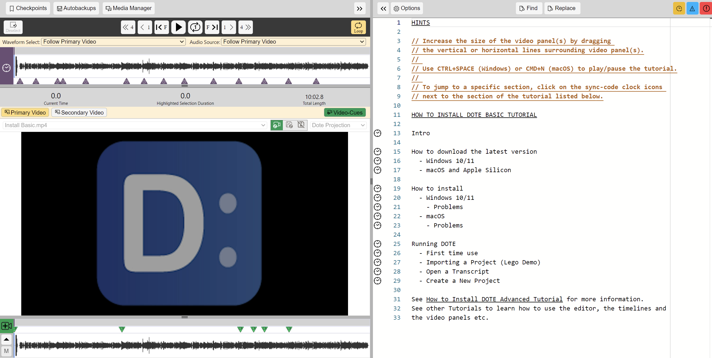

## Video Tutorials

We are producing a range of informative video tutorials to help you get familiar with the amazing functionality of _DOTE_.
The videos are available on our [YouTube channel](#).

The video tutorials mostly come in two flavours: a basic version and an advanced version.
We have created more than 25 videos, including:

- Promotional video — [Basic]()
- How to navigate the webshop — [Basic]()
- How to navigate the online help guide — [Basic]()
- How to install _DOTE_ — [Basic]() — [Advanced]()
- How to apply the license key — [Basic]() — [Advanced]()
- How to work with _DOTE_ projects — [Basic]() — [Advanced]()
- How to use the Media Manager  — [Basic]() — [Advanced]()
- How to playback media — [Basic]() — [Advanced]()
- How to use the video panel(s) — [Basic]() — [Advanced]()
- How to use the timeline(s) — [Basic]()
- How to edit your transcript — [Basic]() — [Advanced]()
- How to use sync-codes — [Basic]() — [Advanced]()
- How to use video-cues — [Basic]() — [Advanced]()
- How to use checkpoints and autobackups — [Basic]() — [Advanced]()
- How to use subtier types — [Basic]() — [Advanced]()
- How to export/import projects and transcripts — [Basic]()
- How to export to RTF — [Basic]() — [Advanced]()
- Error and warnings — [Basic]()

We will be adding to this list and uploading new video tutorials to the YouTube channel.

### _DOTE_-specific tutorial projects

We are also producing tutorials as importable _DOTE_-specific Projects.
These tutorial projects can be stored locally and opened while transcribing using DOTE.
Just open the relevant tutorial project, jump to a specific section of the video, view the instructions, and then reopen the transcript you were working on (eg. from the "Five most recent Transcripts" list in `Open Transcript` panel).

You can download them here or from the archive of [_DOTE_-specific tutorials](<https://github.com/BigSoftVideo/DOTE/releases>) on the releases page.

- [How to install _DOTE_ — Basic]()
- [How to work with _DOTE_ projects — Basic]()
- [How to use the Media Manager — Basic and Advanced]()

Use _DOTE_ to [import each Project](import.md) into your _MY DOTE PROJECTS_ folder, for example.
When you are done importing, you can just open the Transcript in the Project using `File/Open Transcript` and you will see a hyperlinked version of the video with a table of contents in the Editor panel.
Click on a [sync-code](sync-code.md) to jump to that topic in the video.
Simple as that! 👌
