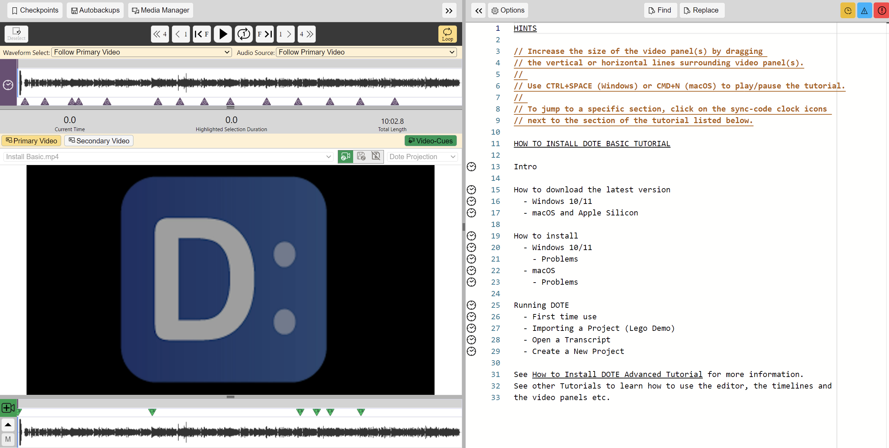

## Video Tutorials

We are producing a range of informative video tutorials to help you get familiar with the amazing functionality of _DOTE_.

We are updating videos incrementally for the release of DOTE v2.0.
The new videos are available on our [v2.0 playlist](https://www.youtube.com/playlist?list=PLQJhL9BD4W1TXjjrwZv0KTJFYifTt8x2Z) on our [YouTube channel](https://www.youtube.com/@DOTEbase), while the older v1.0 videos are still available, especially for functions that have not been updated in v2.0.

We will be adding to this list when we upload new 🆕 video tutorials to our YouTube channel in 2026.

The video tutorials mostly come in two flavours: a **basic** version and an **advanced** version.

We have created more than 50 online videos (8 hours of delicious content), including:

### New videos for v2.0
- What's new in v2.0 - [Basic]() 🆕
- How to use the User Interface - [Basic](https://youtu.be/yjY6x5mEfN0) 🆕
- How to setup DOTE (Settings and Options) - [Basic](https://youtu.be/4ZRAs8DX-eo) 🆕
- How to use the Media Player panel(s) — [Basic](https://youtu.be/dQwelIB2JvM) 🆕
- How to embed Subtitles - [Basic](https://youtu.be/Gvp1U11mfLU) 🆕
- How to use the Timeline(s) — [Basic](https://youtu.be/Oo8EaHRTtFQ) 🆕
- How to use Video-cues — [Basic](https://youtu.be/X9Q2rwaSPoI) 🆕
- How to Undo/Redo - [Basic]() - [Advanced]() 🆕
- How to export Projects, Transcripts and Clips — [Basic]() — [Advanced]() 🆕
- How to import Projects and Transcripts — [Basic]() — [Advanced]() 🆕
- How to use Whisper speech recognition with _DOTE_ - [Basic](https://www.youtube.com/watch?v=7bWMcnJhPGc) 🆕

### Older videos for v1.0 that still work for v2.0

- Introduction to _DOTE_ video — [Basic](https://www.youtube.com/watch?v=1Ebm30ChHxg&list=PLQJhL9BD4W1Trh8mKzPnQ0fqj8J1H00Cd)
- How to navigate the online help guide — [Basic](https://www.youtube.com/watch?v=meYMj7DsYHE&list=PLQJhL9BD4W1Trh8mKzPnQ0fqj8J1H00Cd&index=24)
- How to install _DOTE_ — [Basic](https://www.youtube.com/watch?v=zbB6lczk4f8&list=PLQJhL9BD4W1QD1AD1gGCcOXSUbwu_iNT1&index=1) — [Advanced](https://www.youtube.com/watch?v=RDbYopAerCw&list=PLQJhL9BD4W1Rf33H5FOhn7dbgcH6PEWg5&index=8)
- Key differences between Free and _Pro_ Editions - [Basic](https://www.youtube.com/watch?v=48sfGoE0T2E)
- How to activate the license key — [Basic](https://www.youtube.com/watch?v=IRiWKZYIViA&list=PLQJhL9BD4W1QD1AD1gGCcOXSUbwu_iNT1&index=16)
- How to work with _DOTE_ projects — [Basic](https://www.youtube.com/watch?v=7oHE1KsIGTo&list=PLQJhL9BD4W1QD1AD1gGCcOXSUbwu_iNT1&index=7) — [Advanced](https://www.youtube.com/watch?v=GkjMwL6zqmM&list=PLQJhL9BD4W1Rf33H5FOhn7dbgcH6PEWg5&index=5)
- How to use the Media Manager  — [Basic](https://www.youtube.com/watch?v=enN7aKYZEGg&list=PLQJhL9BD4W1QD1AD1gGCcOXSUbwu_iNT1&index=9) — [Advanced](https://www.youtube.com/watch?v=-xIPZAJoNkU&list=PLQJhL9BD4W1Rf33H5FOhn7dbgcH6PEWg5&index=7)
- How to playback media — [Basic](https://www.youtube.com/watch?v=v86-xkdVwL4&list=PLQJhL9BD4W1QD1AD1gGCcOXSUbwu_iNT1&index=8) — [Advanced](https://www.youtube.com/watch?v=t8yD07eSFWs&list=PLQJhL9BD4W1Rf33H5FOhn7dbgcH6PEWg5&index=6)
- How to edit your transcript — [Basic](https://www.youtube.com/watch?v=dqEehi8Jaa0&list=PLQJhL9BD4W1QD1AD1gGCcOXSUbwu_iNT1&index=14) — [Advanced](https://www.youtube.com/watch?v=U3yPPHZ-yak&list=PLQJhL9BD4W1Rf33H5FOhn7dbgcH6PEWg5&index=11)
- How to use Sync-codes — [Basic](https://www.youtube.com/watch?v=PLUGMdFsbu4&list=PLQJhL9BD4W1QD1AD1gGCcOXSUbwu_iNT1&index=5) — [Advanced](https://www.youtube.com/watch?v=kQK1JImIn9w&list=PLQJhL9BD4W1Rf33H5FOhn7dbgcH6PEWg5&index=3)
- How to use Checkpoints and Autobackups — [Basic](https://www.youtube.com/watch?v=ERUz7esZ5go&list=PLQJhL9BD4W1QD1AD1gGCcOXSUbwu_iNT1&index=3) — [Advanced](https://www.youtube.com/watch?v=06sZFfw7ask&list=PLQJhL9BD4W1Rf33H5FOhn7dbgcH6PEWg5&index=2)
- How to use Subtier Types — [Basic](https://www.youtube.com/watch?v=jHvoOJguWKM&list=PLQJhL9BD4W1QD1AD1gGCcOXSUbwu_iNT1&index=6) — [Advanced](https://www.youtube.com/watch?v=vcgl_hqjMAE&list=PLQJhL9BD4W1Rf33H5FOhn7dbgcH6PEWg5&index=4)
- Error and warnings — [Basic](https://www.youtube.com/watch?v=Ux4APu6ww4k&list=PLQJhL9BD4W1QD1AD1gGCcOXSUbwu_iNT1&index=12)

### How to transcribe using _DOTE_ ([playlist](https://www.youtube.com/playlist?list=PLQJhL9BD4W1S8RVa3O8BlF5pinbYJpK-c))

- Basic [Part 1 How start a new transcript using _DOTE_](https://www.youtube.com/watch?v=raBDE5520gY&list=PLQJhL9BD4W1S8RVa3O8BlF5pinbYJpK-c&index=3)
- Basic [Part 2 How to edit a transcript in progress](https://www.youtube.com/watch?v=7JGCKmTg_6Q&list=PLQJhL9BD4W1S8RVa3O8BlF5pinbYJpK-c&index=4)
- Basic [Part 3: How to import a transcript from another source and conform it to _DOTE_ style](https://www.youtube.com/watch?v=Npfmg7MpCZw&list=PLQJhL9BD4W1S8RVa3O8BlF5pinbYJpK-c&index=1)
- Advanced [Part 1: How to comment on a shared transcript](https://www.youtube.com/watch?v=hc3CH9oOsKQ&list=PLQJhL9BD4W1S8RVa3O8BlF5pinbYJpK-c&index=2)
- Advanced [Part 2: How to make smart notes on audiovisual data before transcribing](https://www.youtube.com/watch?v=oOiJdpextvE&list=PLQJhL9BD4W1S8RVa3O8BlF5pinbYJpK-c&index=5)
- Advanced [Part 3: How to start a Mondadaian transcript from scratch](https://www.youtube.com/watch?v=GWlJe1bbBYs&list=PLQJhL9BD4W1S8RVa3O8BlF5pinbYJpK-c&index=6)
- Advanced Part 4: How to use anonymised proxy media when sharing or presenting transcripts 🔮TBA

### Top Tips ([playlist](https://www.youtube.com/playlist?list=PLQJhL9BD4W1SuuJ8LvN1F6OEw3_wc1j1E)) 🎩

- Tip 1 - [Get your media synced and shipshape before importing](https://www.youtube.com/watch?v=cKWagutZV4I&list=PLQJhL9BD4W1SuuJ8LvN1F6OEw3_wc1j1E)
- Tip 2 - [Get your Settings and Transcript Options in order to speed up workflow](https://www.youtube.com/watch?v=udlOrRBs1z0&list=PLQJhL9BD4W1SuuJ8LvN1F6OEw3_wc1j1E&index=2)
- Tip 3 - [Always `SPEAKER-ID` + `COLON` + `TAB` before talk](https://www.youtube.com/watch?v=vJf6e4Birhg&list=PLQJhL9BD4W1SuuJ8LvN1F6OEw3_wc1j1E&index=3)
- Tip 4 - [Use Autocomplete and named subtier types to do the heavy lifting](https://www.youtube.com/watch?v=-8s8c1pVeLQ&list=PLQJhL9BD4W1SuuJ8LvN1F6OEw3_wc1j1E&index=4)
- Tip 5 - [Use keyboard shortcuts for speed transcribing](https://www.youtube.com/watch?v=_gZ18OZW34U&list=PLQJhL9BD4W1SuuJ8LvN1F6OEw3_wc1j1E&index=10)
- Tip 6 - [Add sync-codes regularly as you proceed](https://www.youtube.com/watch?v=0fELQTTOiW0&list=PLQJhL9BD4W1SuuJ8LvN1F6OEw3_wc1j1E&index=6)
- Tip 7 - [Let _DOTE_ realign stuff for you](https://www.youtube.com/watch?v=wxdd4oequqc&list=PLQJhL9BD4W1SuuJ8LvN1F6OEw3_wc1j1E&index=5)
- Tip 8 - [Add video-cues to highlight phenomena visually](https://www.youtube.com/watch?v=vCE8AY_HmiU&list=PLQJhL9BD4W1SuuJ8LvN1F6OEw3_wc1j1E&index=9)
- Tip 9 - [Add checkpoints regularly with informative messages](https://www.youtube.com/watch?v=1LmINMDzfxk&list=PLQJhL9BD4W1SuuJ8LvN1F6OEw3_wc1j1E&index=8)
- Tip 10 - [Open extra Media Player panels to hone in on an action](https://www.youtube.com/watch?v=eBWNqeIo450&list=PLQJhL9BD4W1SuuJ8LvN1F6OEw3_wc1j1E&index=7)
- Tip 11 - [How to import audiovisual data into a project (possible problems)](https://www.youtube.com/watch?v=_WLkZVxamhY&list=PLQJhL9BD4W1SuuJ8LvN1F6OEw3_wc1j1E&index=11)
- Tip 12 - [How to use proportional timed intervals](https://www.youtube.com/watch?v=4eQw0LBZ04Y&list=PLQJhL9BD4W1SuuJ8LvN1F6OEw3_wc1j1E&index=12)

### Webinars

- [DOTE Webinar, 15th November 2022](https://www.youtube.com/watch?v=_vl98wMknfw)
- [DOTE Webinar, 26th January 2023](https://www.youtube.com/watch?v=xa8ksdc9z0U)

### _DOTE_-specific tutorial projects

We are also producing tutorials as importable _DOTE_-specific Projects.
These tutorial projects can be stored locally and opened while transcribing using DOTE.
Just open the relevant tutorial project, jump to a specific section of the video, view the instructions, and then reopen the transcript you were working on (eg. from the "Five most recent Transcripts" list in `Project Manager` panel).

You can download them here or from the archive of [_DOTE_-specific tutorials](<https://github.com/BigSoftVideo/DOTE/releases>) on the releases page.

- [How to install _DOTE_ — Basic](https://github.com/BigSoftVideo/DOTE/releases/download/v1.0.0-tutorials/DOTE.installation.doteProject)
- [How to work with _DOTE_ projects — Basic](https://github.com/BigSoftVideo/DOTE/releases/download/v1.0.0-tutorials/DOTE.Projects.doteProject)
- [How to use the Media Manager — Basic and Advanced](https://github.com/BigSoftVideo/DOTE/releases/download/v1.0.0-tutorials/Media.Manager.doteProject)

Use _DOTE_ to [import each Project](import.md) into your _MY DOTE PROJECTS_ folder, for example.
When you are done importing, you can just open the Transcript in the Project using `File/Open Transcript` using the `Project Manager`, and you will see a hyperlinked version of the video with a table of contents in the Editor panel.
Click on a [sync-code](sync-code.md) to jump to that topic in the video.
The video also zooms in and out to focus on the topic at hand (using video-cues).
Simple as that! 👌
