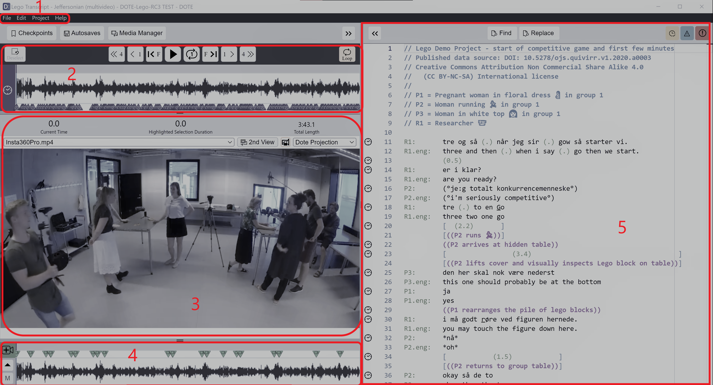

## User interface

The _DOTE_ user interface is comprised of several panels divided into two main sections: the left is for media control functions and the right is for transcript editor functions.
The left section (timelines, video panels) can be collapsed using the `<<` button.
This is useful when you wish to focus (in zen mode) on editing your transcript, esp. with long lines.
The right section (editor) can be collapsed using the `>>` button.
This is useful when you wish to present your video without the transcript.
The panels can be adjusted by grabbing and dragging the divider lines.
Additionally, some panels (video panels, video-cue timeline) can be hidden.
In general, the _DOTE_ window size and the position of the panels is saved between sessions.

1. [The menu bar](#menu)
1. [The function buttons](#function)
1. [The main timeline panel](#timeline)
1. [The video panel(s)](#video)
1. [The video-cue timeline panel](#media)
1. [The editor panel](#editor)

### The menu bar 

Some, but not all, of the commands and shortcuts are available from the pull-down menus.
Some of these menu commands do not have shortcuts.

### The function buttons 

The basic functions for [version control](versioncontrol.md) and [managing media](media.md) are easily accessible via these buttons.

### The main timeline panel 

The height of the [main timeline panel](timeline.md) can be adjusted using the horizontal divider line.

### The video panel(s) 

The height of the [video panel](video.md) can be adjusted using the horizontal divider lines.
The video panels can be opened or hidden by clicking the `Primary Video` and `Secondary Video` buttons at the top left.

### The video-cue timeline panel 

The [video-cue timeline panel](timeline.md#video-cue) can be collapsed using the down arrow button.
The video-cue timeline panel for managing [video-cues](cues.md) can be opened or hidden clicking the `Video-cues` button at the top right of the video panel.

### The editor panel 

The width of the [editor panel](transcript.md) can be adjusted using the vertical divider line.
The editor panel has a minimap scroll bar, which displays information about incidences and type of incidence of a selection made in the editor.
