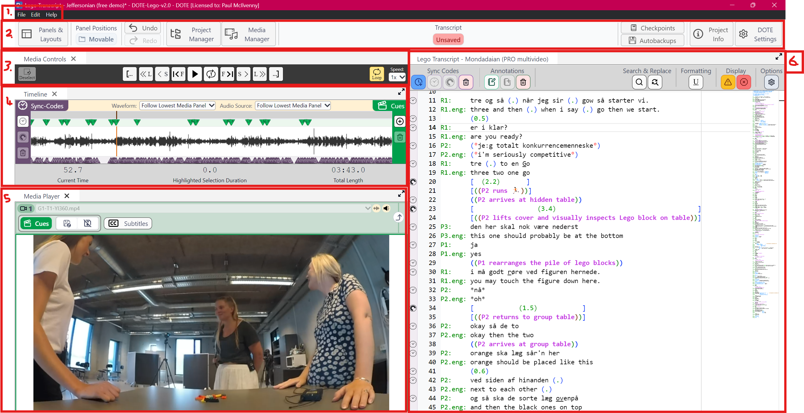

## User interface

The _DOTE_ user interface is comprised of several panels that can be resized and relocated within the DOTE application window.

### Main panels in the user interface

1. [The menu bar](#menu)
2. [The function buttons](#function)
3. [The Timeline panel](#timeline)
4. [The Media Player panel(s)](#media-player)
5. [The editor panel](#editor)

#### The menu bar 

Some, but not all, of the commands and shortcuts are available from the pull-down menus.
Some of these menu commands do not have shortcuts.

#### The ribbon 

The basic functions for [version control](versioncontrol.md) and [managing media](media-manager.md) are easily accessible via these ribbon buttons.

#### The timeline panel 

The height of the [main timeline panel](timeline.md) can be adjusted using the horizontal divider line.

#### The Media Player panel(s) 

The height of the [Media Player panel](media-panel.md) can be adjusted using the horizontal divider lines.
The Media Player panels can be opened or hidden by clicking the `Primary Video` and `Secondary Video` buttons at the top left.

#### The Transcript panel 

The width of the [Transcript panel](transcript.md) can be adjusted using the vertical divider line.
The editor panel has a minimap scroll bar, which displays information about incidences and type of incidence of a selection made in the editor.

### Adjusting a panel

The left section (timelines, Media Player panels) can be collapsed using the `<<` button.
This is useful when you wish to focus (in zen mode) on editing your transcript, esp. with long lines.
The right section (editor) can be collapsed using the `>>` button.
This is useful when you wish to present your video without the transcript.
The panels can be adjusted by grabbing and dragging the divider lines.
Additionally, some panels (Media Player panels, video-cue timeline) can be hidden.
In general, the _DOTE_ window size and the position of the panels is saved between sessions.

### Modes of informativeness

To enable the user to quickly change the amount of information displayed across the user interface, there are several predefined modes that show or hide text, buttons, ribbons, etc. in the user interface and all open panels.

- Automatic
- Full
- Compact
- Minimal

### Layouts

Additionally, [default or user-defined layouts](layout.md) of panels can be selected to quickly refocus the user interface for a specific task, such as playing a video to an audience in a presentation, focusing on multiple videos to isolate some visual phenomenon or working in a zen mode with just the transcript.

