## User interface

The _DOTE_ user interface is comprised of several panels that can be resized and relocated within the DOTE application window.

### Main panels in the user interface

1. [The menu bar](#menu)
2. [The ribbon bar](#ribbon)
3. [The Media Controls panel](#play)
4. [The Timeline panel(s)](#timeline)
5. [The Media Player panel(s)](#media-player)
6. [The Editor panel](#editor)

#### The menu bar 

[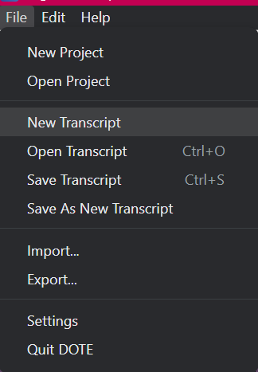](images/UI/UI-menu.png)

Some, but not all, of the commands and shortcuts are available from the pull-down menus.
Some of these menu commands do not have shortcuts.

#### The ribbon bar 

[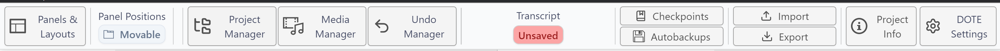](images/UI/UI-ribbon.png)

The basic functions for [Panels & Layout](ui.md), [Undo](undo.md), [version control](versioncontrol.md), [Project Manager](projects.md), [Media Manager](media-manager.md), [Project Info](project-info.md) and [DOTE Settings](settings.md) are easily accessible via these ribbon bar buttons.
Hover over a button to see a pop-up description.

#### The Media Controls panel 

[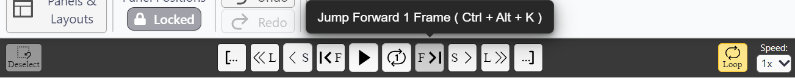](images/UI/UI-play.png)

The buttons for controlling [playback and selecting/looping segments](play.md).
Hover over a button to see a pop-up description.

#### The Timeline panel(s) 

[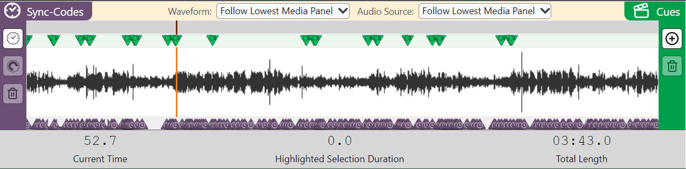](images/UI/UI-timeline.png)

The height of the [main timeline panel](timeline.md) can be adjusted using the horizontal or vertical divider lines between it and another panel.

#### The Media Player panel(s) 

[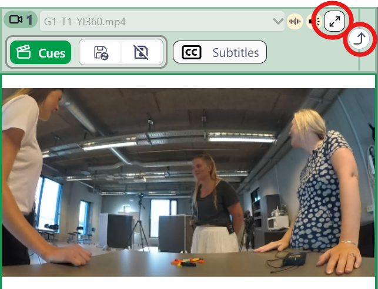](images/UI/UI-media-player.png)

The height of the [Media Player](media-panel.md) panel can be adjusted using the horizontal or vertical divider lines between it and another panel.
The panel can be expanded to full screen and the options hidden.

#### The Editor panel 

[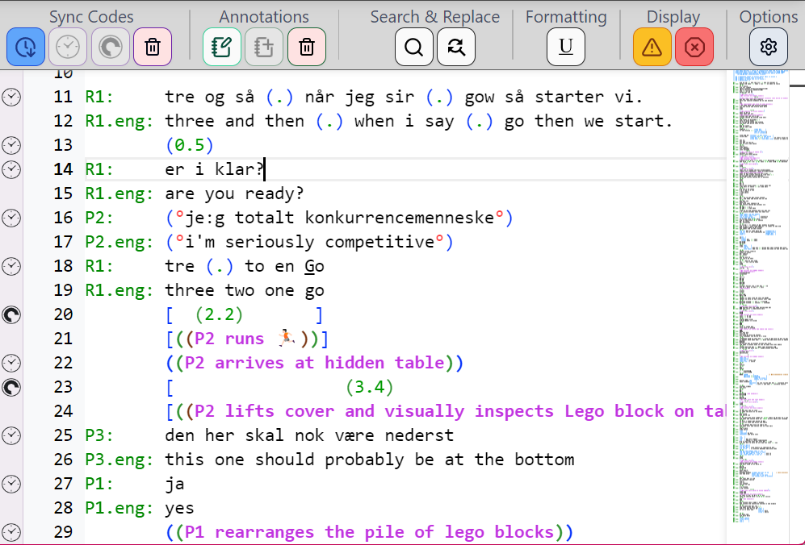](images/UI/UI-editor.png)

The width of the [Editor](transcript.md) panel can be adjusted using the horizontal or vertical divider line between it and another panel.
The Editor panel can never be closed, though it can be hidden in a Tab on another panel.

[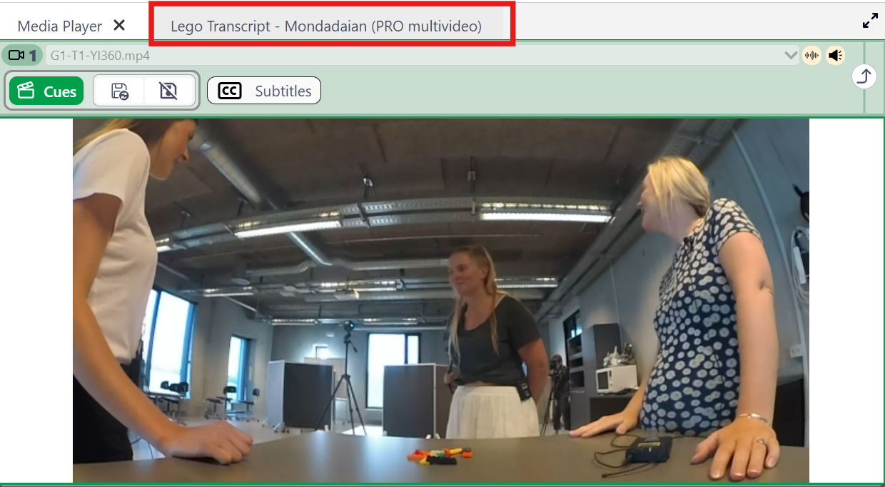](images/UI/UI-tab.png)

### Adding a new panel

Some tools can be added as new panels repeatedly, eg. Media Player panel and Timeline Panel.
Some panels can only have one instance but can be removed from the user interface, eg. Play Transport panel.
Other panels cannot be removed from the user interface, eg. Transcript Editor panel.

[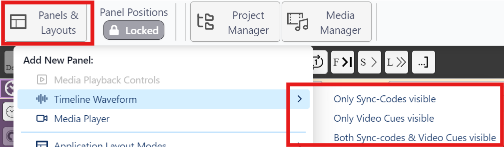](images/UI/add-panel.png)

- Click on the Panels & Layouts button at the top left of the ribbon bar.
- Select from the `Add New Panel` list.

### Resizing a panel

The panels can be adjusted by grabbing and dragging the divider lines between panels.
Additionally, some panels (Media Player panels, Timelines) can be hidden as tabs behind another panel.
In general, the _DOTE_ window size and placement, and the position and size of the panels, is saved between sessions.

[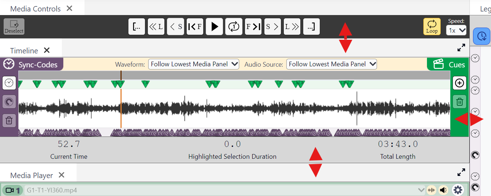](images/UI/adjust-panel.png)

### Maximize a panel

Some panels can also be maximised, eg. the Media Player panels and the Editor panel, by clicking the maximize icon at the top right of the panel.
When combined with Zen panel action (see below), then the video is prioritised for a presentation.
To minimize back to its original position, click the minimize icon at the top right of the panel.

[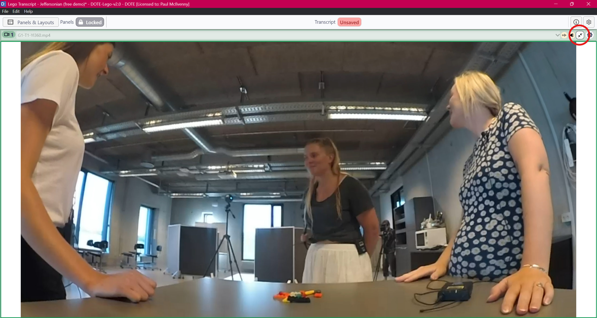](images/UI/panel-max.png)

### Adjusting the position of panels

Panels can reside as a lone panel taking up space in the window or hidden as a TAB with one or more other panels.
Panels can be grabbed and moved around the user interface.

1. Make sure that Panel Positions is set to Moveable (not Locked) in the Ribbon bar.
1. Click on the header bar of panel and drag it around the user interface.
1. A grey rectangle will indicate the new position that it could be dropped into or a TAB will be highlighted.
1. Drop the panel in the location desired.

[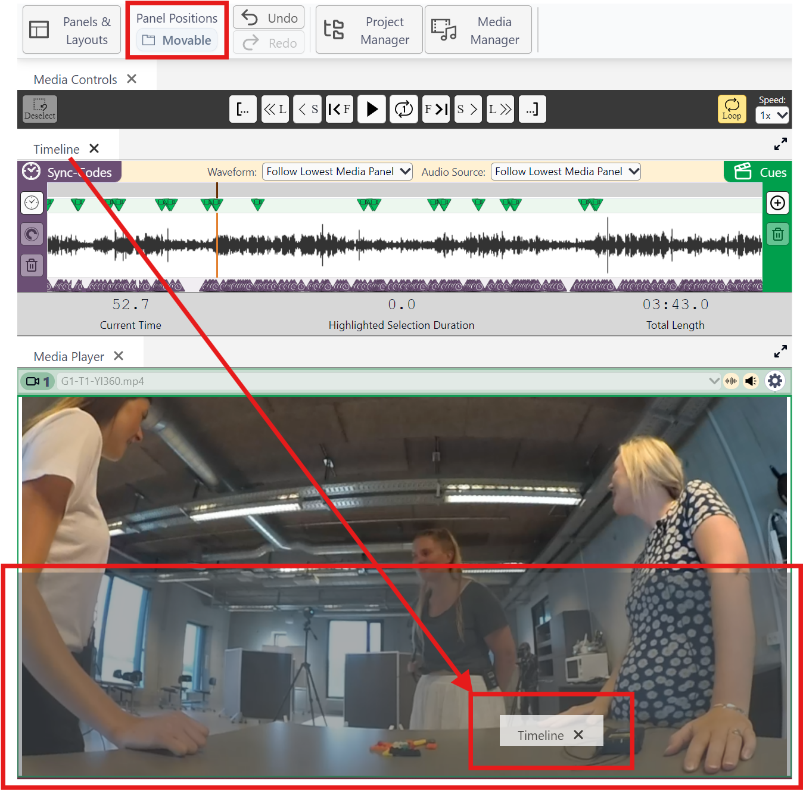](images/UI/panel-position.png)

### Application layout modes

To enable the user to quickly change the amount of information displayed across the user interface, there are several predefined modes that show or hide text, buttons, ribbons, etc. in the user interface and all open panels.

[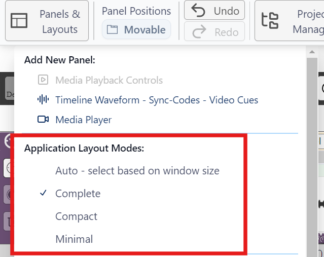](images/UI/layout.png)

Select from the `Panels & Layouts` button menu:

- Auto - change to one of the other modes according to the size of the window on the desktop.
- Complete - Show all verbal descriptions + icons.
- Compact - Reduce the amount of verbal information but keep icons.
- Minimal - Reduce verbal information and keep only essential icons.

### Panel Actions

Also, from the `Panels & Layouts` button menu, there are some quick actions that modify the presentation of information in panels:

[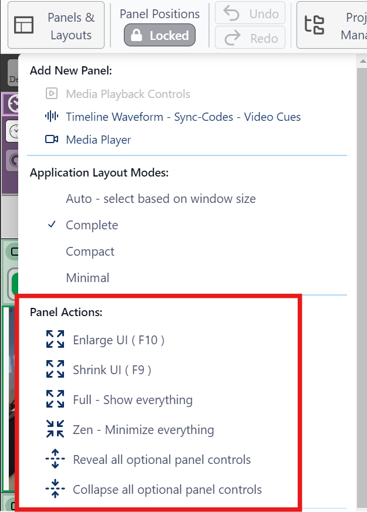](images/UI/panel-actions.png)

- Full - show all information (verbal not just icons) - this also changes to Complete mode.
- Zen - hide everything (including verbal and panel options) - this also changes to Minimal mode.
- Reveal all optional panel controls (just the controls).
- Collapse all optional panel controls - they can be expanded universally via Reveal option or individually expanded using the shrink/expand button on each relevant panel.

Zen mode in action:

[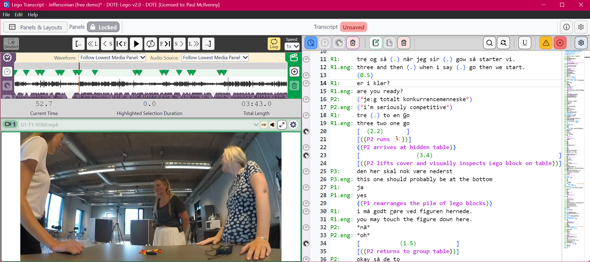](images/UI/UI-zen.png)

### Layouts

Additionally, [default or user-defined layouts](layout.md) of panels can be selected to quickly refocus the user interface for a specific task, such as playing a video to an audience in a presentation, focusing on multiple videos to isolate some visual phenomenon or working in a zen mode with just the transcript.
