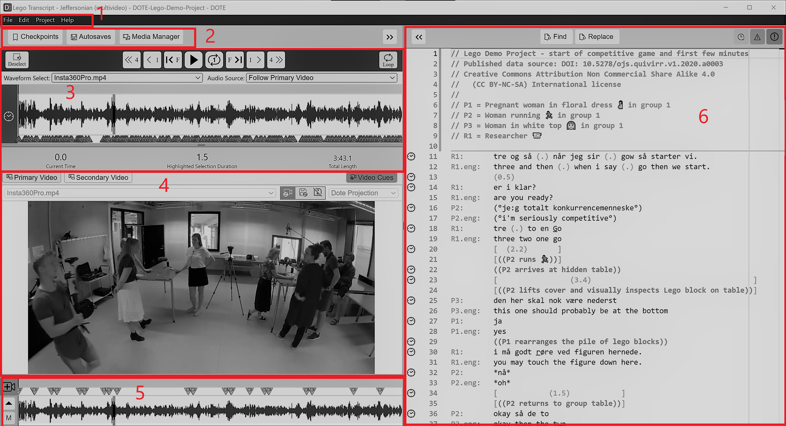

## User interface

The _DOTE_ user interface is comprised of several panels divided into two main sections: left and right.
The left section (timelines, video) can be collapsed using the `<<` button.
This is useful when you wish to focus on editing your transcript.
The right section (editor) can be collapsed using the `>>` button.
This is useful when you wish to present your video.
The panels can be adjusted by grabbing and dragging the divider lines.
In general, the _DOTE_ window size and the position of the panels is saved between sessions.

1. [The menu bar 1](#menu)
1. [The main timeline panel 2](#timeline)
1. [The video panel(s) 3](#video)
1. [The media timeline panel 4](#media)
1. [The editor panel 5](#editor)

### The menu bar 

Some, but not all, of the commands and shortcuts are available from the pull-down menus.
Some of these menu commands do not have shortcuts.

### The main timeline panel 

The height of the [timeline panel](timeline.md) can be adjusted using the horizontal divider line.

### The video panel(s) 

The height of the [video panel](video.md) can be adjusted using the horizontal divider line.
The video panels can be opened or hidden by clicking the buttons at the left underneath the main timeline.

### The media timeline panel 

The [media timeline panel](timeline.md) can be collapsed using the down arrow button.
The media timeline panel for video-cues can be opened or hidden clicking the button at the right underneath the main timeline.

### The editor panel 

The width of the [editor panel](transcript.md) can be adjusted using the vertical divider line.
The editor panel has a minimap scroll bar, which displays information about incidences and type of incidence of a selection made in the editor.
