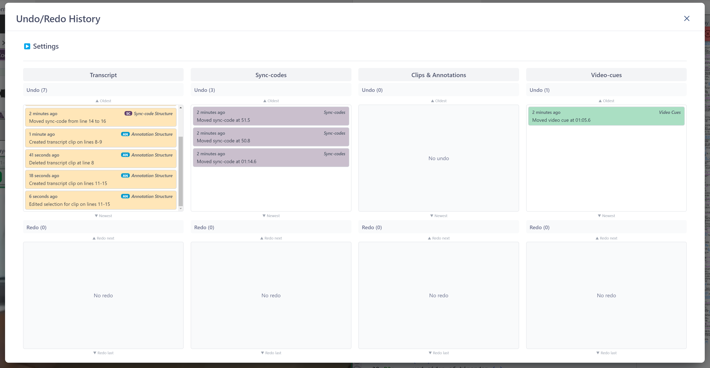
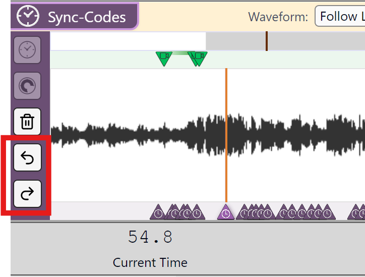
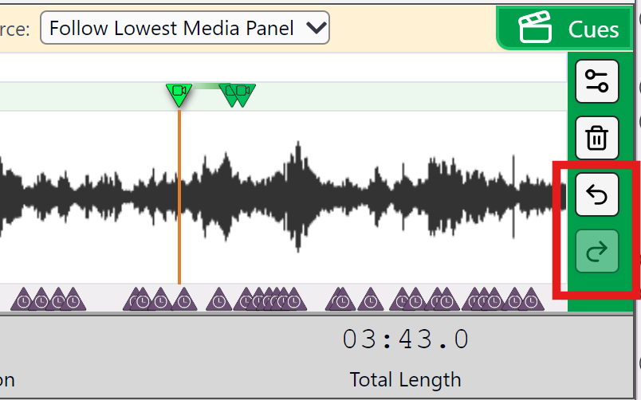
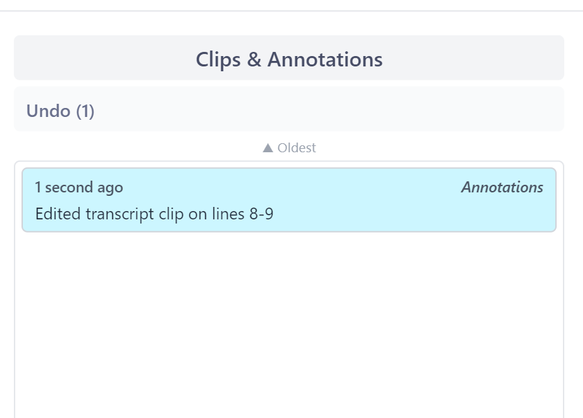
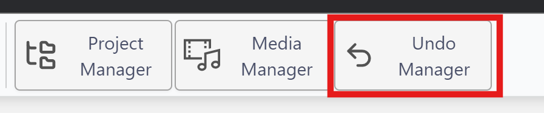
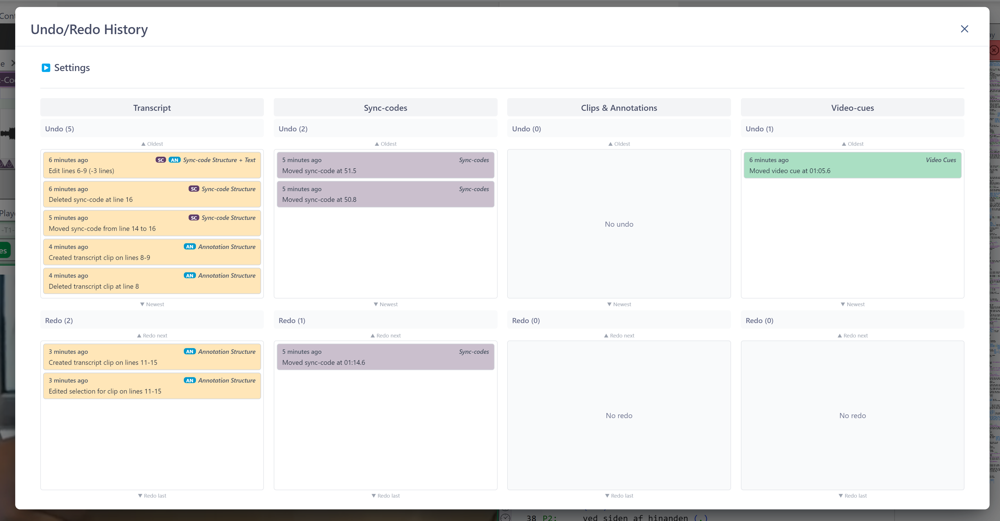
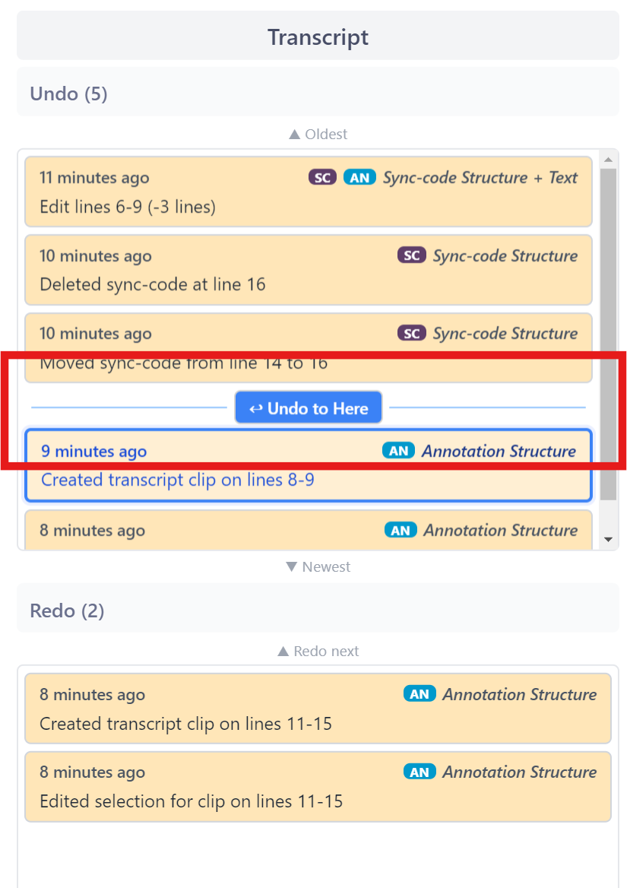
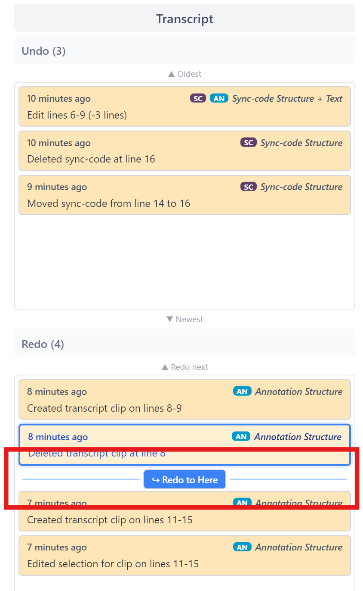

## How to Use the Undo/Redo Manager

With v2.0 we have implemented an extra Undo/redo Manager that tracks changes to changes that are often more invisible, but which may be desirable to undo, such as underlining, as well as changes to Sync-codes or Video-cues.

Watch the [video tutorial on YouTube](https://www.youtube.com/watch?v=pYV9iSf-rSo).

There are four different Undo/Redo stacks, which means that one can track changes made while using _DOTE_ independently of changes in other panels, eg. changes in the [Transcript Editor](transcript.md), changes to [Sync-codes](sync-code.md) and [Video-cues](cues.md) in the [Timeline](timeline.md) panel and edits to [Transcript Clips](transcript-clip.md).

However, some actions cannot be undone in one stack without undoing one or more actions in another stack.
For example, if one has adjusted a[ Sync-code](sync-code.md) on the [Timeline](timeline.md), then added some text on a new line in the [Transcript Editor](transcript.md) before the Sync-code that was just adjusted, then one cannot simply undo all the text on the new line that was recently added.
Undo must also undo the change that was implicitly made to the Sync-code by adding a new line, ie. the new line shifted all the Sync-codes down one line, so if this was not undone as well, then all the Sync-codes after that new line would be out of sync with the Transcript.
Therefore, some Undos require more expansive undoing of actions that may seem independent but are not.
_DOTE_ will warn you of these types of Undos before committing them.

Note that changing anything after performing an Undo will create a completely new stack of actions to Undo because a new future state is being created.
So be careful: make sure that you are happy with the Undo state before making any new changes.
Once you have made a change on top of the Undo state that you have rolled back to, then there is no rolling forward to those old changes that were undone.

### Simple Undo/Redo in the Transcript Editor panel

It is still possible to undo and redo simple textual changes directly in the [Editor](transcript.md) panel.
Note that this only applies to changes to the typed text, not underlining, and only to sync-codes if they are repositioned because of a textual edit, eg. a line is inserted or deleted.

- Use the shortcut [ <kbd>CRTL</kbd> + <kbd>Z</kbd> ] -OR- [ <kbd>⌘</kbd> + <kbd>Z</kbd> ] to undo the most recent edit.
- Use [ <kbd>CRTL</kbd> + <kbd>Y</kbd> ] -OR- [ <kbd>⌘</kbd> + <kbd>SHIFT</kbd> + <kbd>Z</kbd> ] to redo the most recent action that was undone.
- Editing actions can be successively undone step-by-step in reverse order of how they done.
- Note, as discussed above, that some undo operations will require other actions outside of the Editor to be undone as well.

### Simple Undo/Redo of Sync-codes in a Timeline panel

When a [Sync-code](sync-code.md) is created or edited/moved/deleted, an Undo and a Redo button appears on each Timeline on the left side (purple).

### Simple Undo/Redo of Video-cues in a Timeline panel

When a [Video-cue](cues.md) is created or edited/moved/deleted, a green Undo and a green Redo button appear on each Timeline on the right side of the panel.

### Changes to Transcript Clips & Annotations

To undo editing changes to [Clips & Annotations](transcript-clip.md) you may find it easier to use the Undo Manager to find a point before the change to rollback to.

### Opening the Undo Manager

The Undo Manager allows the user to track all the recent changes and adjust the number of operations that can be undone in the history.

The Undo Manager keeps a stack of changes for four types of actions.

- The stacks are indicated by four columns, in which the history of relevant actions is listed.
- At the top is last known change.
- At the bottom is the oldest change.
- Not every single keystroke generates an action. Actions are granular, and often stored in batches if they happen in quick succession.
- Sometimes actions in one column are connected to another action in another column.
This is indicated by the colour + icon and, when an action is selected, by a highlighting of interdependent actions.

### Rolling back changes

- One can select a change that you wish to undo in one of the stacks.
- The point in the stack to which the changes will be undone is indicated by "Undo to Here".
- Any interdependent changes will also be highlighted.
- Click the `Undo` button.
- A warning will sometimes popup to double check you wish to proceed.

### Redoing changes

- Underneath each of the Undo stacks is a complementary Redo stack.
- These will only be populated if one or more actions have been already Undone.
- An action or group of actions can be selected and Redone.
- The point in the stack to which the changes will be redone is indicated by "Redo to Here".

### What is NOT tracked by the Undo Manager

The Undo Manager does _not_ track changes to [Settings or Transcript Options](settings.md).
_Nor_ does it track the creation of [Checkpoints and Autobackups](versioncontrol.md).
