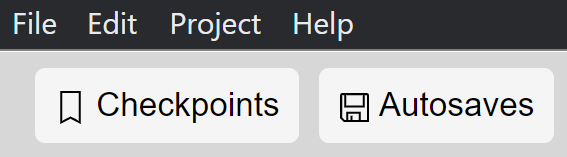

## Two backup systems

_DOTE_ has two different and independent backup systems to keep track of your editing work and to support reliable backtracking to an earlier version. Grand! 🎊

The backup systems will enable a user to restore a prior state of a transcript at a particular point in time, including the [transcript text](transcript.md), [sync-codes](sync-code.md), [named subtier types](tiers.md) and some local Editor settings in [Transcript Options](settings.md#options).

[Autobackups](#autobackup) are auto-generated and provide a simple backup in case one is not saving the current Transcript frequently.
On the other hand, [Checkpoints](#checkpoint) are a user-driven system of backup that is semantic and timely.

Note that [Autobackup](#autobackup) is not the same as _saving_ a Transcript using `File ➔ Save Transcript` or <kbd>CTRL</kbd>+<kbd>S</kbd> [or <kbd>⌘</kbd>+<kbd>S</kbd> on macOS].
Autobackup makes a _new copy_ of the current Transcript and writes that to disk so the previous state can be recovered, while saving writes the Transcript data to disk.
Autobackup does _not_ save the current Transcript automatically; that is a manual decision by the user.
It just makes a series of backup copies at regular intervals.

### Setting up Checkpoints and Autobackups 

To use Checkpoints and to peek at Autobackups, one must first install some free, open-source software called _Git_ on your computer.
It is totally safe and ad-free if you download from the official site or via your operating system (macOS).
We strongly recommend you do this when using _DOTE_, especially since checkpoints will support informative, fine-grained control over the changes you make as you transcribe.
Autobackups will work without _Git_ installed, but you will have to manually restore a specific Autobackup using the file system (look in the hidden autobackup folder in the transcript folder on disk).

<!-- TODO: add instructions and warning about safe.repository command -->

Here are instructions how to download and install _Git_:

- For Windows -
    - Download [here](https://git-scm.com/download/win).
    - Choose the 32- or 64-bit version for your version of Windows.
    - Run the _.exe_ and follow the instructions.
    - It is usually fine just to accept the default options that are suggested.
    There are quite a few of them (and some look quite technical but don't worry).
- For macOS -
    - After starting _DOTE_, and clicking Checkpoints, then macOS will prompt you to install _Git_.
    - If this does not happen, then you can also install directly in macOS.
        - Press <kbd>⌘</kbd>+<kbd>SPACE</kbd> and type <kbd>terminal</kbd>.
        Press <kbd>ENTER</kbd>.
        - When the window appears, type <kbd>git</kbd>.
        Press <kbd>enter</kbd> again.
        Follow the instructions.
    - In either case, your macOS may first need to update some files.
    Update, restart and try again.

Once this is done, then you shouldn't need to worry anymore about _Git_.
Every now and again, you might wish to download a new version and upgrade by installing it again.
This may be wise, since security issues may arise that require an upgrade to solve.

#### Git/Checkpoint Troubleshooting 

Some macOS users have reported the following error when using Checkpoints.

> Failed to initialize checkpoints. Error was: Error: xcrun: error: invalid active developer path (/Library/Developer/CommandLineTools), missing xcrun at: /Library/Developer/CommandLineTools/usr/bin/xcrun

If you get this or a similar error, then do the following (after closing _DOTE_):

1. Press these two keys together: <kbd>⌘</kbd> and <kbd>SPACE</kbd>
2. Type `terminal` then press <kbd>ENTER</kbd>
3. Type `xcode-select --install` and press <kbd>ENTER</kbd>
4. Restart the computer and try again with _DOTE_ Checkpoints.

### How to save a Transcript 

The basic way to save a currently open Transcript is to select `File ➔ Save Transcript` or use the shortcut <kbd>CTRL</kbd>+<kbd>S</kbd> [or <kbd>⌘</kbd>+<kbd>S</kbd> on macOS.
Doing so will save the unsaved changes in the Transcript to disk.

- If no new checkpoints have been made and autobackup is turned off, then any unsaved changes will be lost if the computer or _DOTE_ crashes, for example.
Hint: save your work frequently and make checkpoints regularly.
- If autobackup is turned on, but the autobackup time interval has not been reached, then the most recent changes made since the last autobackup will not be recoverable if the computer crashes, etc.

### Autobackup and restoring a Transcript 

_Autobackup_ is built into _DOTE_ in the following manner:

- The default autobackup is every 5 minutes, but this can be changed in [Settings](settings.md).
Autobackups are stored in a hidden folder in the transcript folder, but _DOTE_ has its own interface for listing all autobackups and peeking at the state of the Transcript at a specific autobackup.
- By clicking on `Autobackups`, a user can _peek_ at any prior autobackup and play the video and scroll through the transcript as it was at that autobackup.
Editing while peeking is not allowed.
- The user can then decide to restore an earlier version of the Transcript (the state of the Transcript up to and including the peeked autobackup) or to reset to an earlier version up to but not including the changes in the peeked autobackup.
If neither, then one can just return to the current state of the Transcript before peeking at the autobackups.
- If a user does decide to restore an earlier version, then it is loaded as the current Transcript, but all autobackups up to the present moment are retained; it is non-destructive.
Thus, the user can decide later to restore to a version that came after the restored version.  
- At present in this release, it is not possible to prune the autobackup list in _DOTE_, but it can be done manually in the hidden _.autosaves_ folder on disk.
- Sometimes a user will have to create a checkpoint before restoring an earlier autobackup, otherwise the unsaved changes will not be stored in the checkpoint system.
The user can also decide not to do this and just restore while discarding any unsaved changes.
- After restoring an autobackup, there will be unsaved changes ("non-recorded state") in the checkpoints.
This is because the new state of the transcript will not match the last checkpoint state and the differences will have to be checkpointed as new unsaved changes.
Autobackups and Checkpoints are independent version control systems.
- After the restore is complete, the Transcript will be opened.
- Also, a new Checkpoint will be created automatically with an informative message to mark that all the new changes in the Transcript are the result of restoring a specific Autobackup.

### Checkpoints in a Transcript 

The _checkpoint_ system uses a special version control system behind the scenes, namely _Git_.
_Git_ is a secure, free, open source software with absolutely no advertising or spyware.
DOTE implements a simple version control for a single user, but experienced users can also use GitHub and a Git GUI to collaborate on shared transcripts in a distributed manner.

#### How to use checkpoints

- At any time, you can click on `Checkpoints` and see a list of prior checkpoints for the current transcript.
- After making some meaningful changes to a transcript, it is a good idea to create a new checkpoint.
If there have been changes made (unsaved or saved) since the last checkpoint, then this is noted as a "Non-recorded state".
- A user can then type in a message that will be attached to a new checkpoint after selecting `Create Checkpoint`.
If no message is given, then a random three word + emoji phrase is added instead.
- When a new checkpoint is created, the Transcript and Project is also saved to disk in the usual way.
- As with autobackup, a user can _peek_ at an earlier checkpoint and play the video and scroll through the Transcript as it was saved at that checkpoint.
Editing while peeking is not allowed.
- The user can then decide to restore to an earlier state of the Transcript up to and including the peeked Checkpoint, _or_ to reset to the earlier state prior to the current peeked Checkpoint, ie. _not_ including the changes in the peeked Checkpoint.
- Whichever is chosen (restoring or resetting), then there are two choices:
    1. Restore or reset to the selected checkpoint and discard all later changes (eg. all later checkpoints are lost).
        - This is destructive.
        - However, the list of autobackups will not be pruned.
        - After resetting is complete, the Transcript will be opened.
    1. Spin off a new Transcript in the Project to match the state of the Transcript at the selected checkpoint.
    The user will be asked to give a name for the new transcript.
        - This is non-destructive since the original transcript will still exist in the project and can be reopened.
        - Only the checkpoints prior to the selected checkpoint will still exist in the new Transcript.
        - Note that after creating a new transcript, the checkpoints before the restored checkpoint will remain in the list, but the list of autobackups is reset and starts again from scratch.
        - The user will be prompted to save any non-recorded state changes in the original Transcript.
        - The new Transcript is automatically opened in _DOTE_.

> **NOTE: Peeking at or restoring/resetting checkpoints (and autobackups) can take some time, depending on several factors, including the access speed of your storage device. This could take more than 1 second, sometimes more than 5 seconds.**

#### Comparing checkpoints and autobackups 

_DOTE_ provides a user interface to display exactly what has changed in the Transcript between specific autobackups as well as what has changed in the Transcript between specific checkpoints, eg. between the current version of the Transcript and the previous checkpoint version.

##### Comparing checkpoints

1. Open `Checkpoints`.
1. By default, the Compare function is toggled on (see tick box).
You can turn it off and on as you see fit.
1. If you turn Compare mode off, then you will see the Transcript _and_ sync-codes, which you can use to jump around.
The current audio track will be playable (but the video will not be visible).
And you can use [Find](find.md) to locate a text string in the earlier version.
Because you are only peeking at an earlier version, the Transcript and the sync-codes will _not_ be editable.

The Compare function displays several useful bits of useful information:

- By default, the comparison displayed on the right panel is between the current state of the Transcript (saved or unsaved) and the state it was when the last checkpoint was made.
- If you select and peek at a specific checkpoint in the past, then the comparison displayed is between the peeked checkpoint and the previous one.
- The two lists of line numbers on the left of the panel represent the line numbers for the previous and current states of the Transcript respectively.
- If a line is added or changed in the current checkpoint, then it is marked in green with a green `+`.
- If a line is deleted or changed in the previous checkpoint, then it is marked in red with a red `-`.
- Any additions on a line are marked in a darker green, and any deletions on a line are marked with a darker red.
- The changes are highlighted in the scroll bar minimap on the right side of the panel.
- Thus, one can instantly see what was changed in the transcript from one version to the next and where those changes are in the Transcript as a whole.
- Note: If you restore or reset the Transcript to match the Checkpoint that is being peeked, then the highlighted changes in green will be included in the restored Transcript.

Be patient with the updating when switching between checkpoints.
There is a lot of file processing involved in recovering the Transcript history over time, so updates may sometimes take a second or two depending on the power of your computer.

In future releases, one will be able to compare any checkpoint with any earlier checkpoint (non-consecutive), as well as display the changes in different formats using search and marking authorship.

##### Comparing Autobackups

1. Open `Autobackups`.
1. By default, the Compare function is toggled on (see tick box).
You can turn it off and on as you see fit.
1. If you turn Compare mode off, then you will see the Transcript _and_ sync-codes, which you can use to jump around.
The current audio track will be playable (but the video will not be visible).
And you can use [Find](find.md) to locate a text string in the earlier version.
Because you are only peeking at an earlier version, the Transcript and the sync-codes will _not_ be editable.

The Compare function displays several useful bits of useful information:

- By default, the comparison displayed on the right panel is between the current state of the Transcript if there are unsaved changes and the state it was when the last autobackup was made.
- If you select and peek at a specific autobackup in the past, then the comparison displayed is between the peeked autobackup and the previous one.
- The two lists of line numbers on the left of the panel represent the line numbers for the previous and current states of the Transcript respectively.
- If a line is added or changed in the current autobackup, then it is marked in green with a green `+`.
- If a line is deleted or changed in the previous autobackup, then it is marked in red with a red `-`.
- Any additions on a line are marked in a darker green, and any deletions on a line are marked with a darker red.
- The changes are highlighted in the scroll bar minimap on the right side of the panel.
- Thus, one can instantly see what was changed in the transcript from one version to the next and where those changes are in the Transcript as a whole.
- Note: If you restore or reset the Transcript to match the Autobackup that is being peeked, then the highlighted changes in green will be included in the restored Transcript.

Be patient with the updating when switching between autobackups.
There is a lot of file processing involved in recovering the Transcript history over time, so updates may sometimes take a second or two depending on the power of your computer.

In future releases, one will be able to compare any autobackup with any earlier autobackup (non-consecutive), as well as display the changes in different formats using search and marking authorship.

### What is tracked by Autobackups and Checkpoints? 

Both Autobackups and Checkpoints track the changes made to the text in the Editor panel, eg. in the transcript.
This includes underlining and sync-codes, as well as some options at the Transcript level (eg. font size, margins, subtiers, conventions in [Transcript Options](settings.md#options)).
Thus, if one restores (or resets) to an earlier Autobackup or Checkpoint, then not only will the Transcript revert back to the earlier state, but also the basic options for the layout of the Transcript in [Transcript Options](settings.md#options) will also be reverted.

On the other hand, [video-cues](cues.md) and a range of other [Settings](settings.md) are _not_ tracked, including [active media](media.md), projection views, [warning/error toggles](errors.md), locking video views, [muting, volume](timeline.md), etc.
They cannot be recovered using Autobackups and Checkpoints.

### Using GitHub and a Git GUI to collaborate on shared Transcripts 

If you are experienced with using Git and you have an account on `GitHub`, for example, then you can share _DOTE_ Transcripts with others and collaboratively edit them.
The transcript folder in any _DOTE_ project is a Git root folder.
It can be synced with a repository on GitHub.
The contents of the project folder, on the other hand, will have to be manually shared amongst all the collaborators.
Checkpoints are commits on the main branch.
Collaborators can push and pull the main branch between local and origin (on GitHub) and checkpoints will be updated locally.
We recommend using a Git GUI such as _GitKraken_ to clone and track the repository locally and remotely.
The usual advice and warnings about [Git best practices](https://acompiler.com/git-best-practices/) apply in this use case.

### Notes on _DOTE_ and Git for advanced users

If you have never used Git software before, and you will only use it with _DOTE_, then read no further.
However, if you use Git for software development, for example, then be aware that _DOTE_ automatically sets `safe.directory` to all (`'*'`).
That is because if one [exports and imports DOTE Projects or Transcripts](import.md), and shares those exported file(s) with others or on different machines, then without a universal `safe.directory` setting, those Projects and Transcripts will not be immediately importable.
It is a question of ownership and security.
Rather than the user having to issue commands repeatedly to make directories safe for Git operations, we assume that all directories are safe.
This is fine if one does not use Git for other purposes.
Read more about `safe.directory`(<https://git-scm.com/docs/git-config/2.35.2>).
