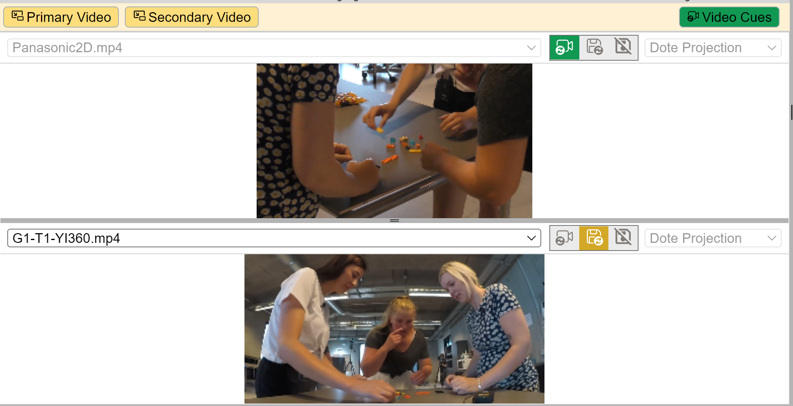

## Video Panels

When you start _DOTE_ or create a new project, only one video panel is displayed by default: the `Primary Video` panel.
Select and drag the `window divider` at the bottom to adjust the relative size of the video panels.
The video format, either 360 or 2D, must be set in the [Media Manager](media.md), so that the video will appear correctly.
For 360 videos, one can choose from three different projection systems for each video panel.
Experiment to see which one suits your 360 video recording.

The `Primary Video` panel can be hidden, so no video is displayed.
Selecting `Secondary Video` will open a second video panel _for the same_ video source, though the source can be changed using the pull-down menu of [active media](media.md) in the current Transcript.
Both video panels can be independently manipulated to show different parts of the same or a different 2D or 360 video image simultaneously.
This means one can simultaneously zoom in on one viewpoint of the video image while also looking at a second viewpoint at a different zoom scale or in another direction.
Or one can open the view from one camera, while also looking at the view from a different one.
Lush! 🌱

### More than one video available in active media

If one has imported _more than one_ video source into the current Project using [Media Manager](media.md), and made them active for the current Transcript, then the video panel will list the available videos in a pull-down menu at the top left of the video panel.

 Lock to Video-cues

 Save viewport

 Freeview

1. One can manually switch between active videos and viewports on the fly.
However, this is only possible if the primary video panel is not locked to Video-cues; if it is locked, then it will always follow the active video selected in video-cues.
2. By clicking the save viewport button, and thus follow Video-cues is deactivated, then one can automatically save and restore whatever video is selected and any changes to its viewport in the current video panel.
3. In addition, if freeview is selected, and thus follow Video-cues and save viewport are deactivated, the active media showing in the primary video panel can be selected manually, as can the zoom and pan.
Changes will not be saved.

Depending on the quality and bit rate of the videos and the power of your computer, one can play/loop the video and switch live between synchronised videos of the event that the current Project (and Transcripts) covers.

One may need to use the `Secondary Video` to setup another view for the same or an alternative video source, especially with 360 videos.
This is very useful when multiple cameras (and mics) were used to collect data, and the originals have been edited into shorter synchronised clips to be imported into _DOTE_.
Sometimes one has to switch to a different camera or mic in order to be able to see or hear the action.
Fantasmagoric! 🤸🏻‍♂️🥳

### Some tips for using the video panels

- The relative size of the video panels can be changed by selecting and dragging the divider between them.
- One can zoom in by using <kbd>right click</kbd> and dragging the mouse vertically (or use the shuttle wheel on a mouse or two fingers on a touchpad).
- One can reposition the focus of the primary or secondary view using <kbd>left click</kbd> and dragging the mouse.
This is especially useful for composite 2D video clips and 360 video clips.
- The view in each video panel can be independently _locked_ to the inserted [video-cues](cues.md).
This means that the video panel will follow the cues that manipulate the view that the user sees.
- Or the video and viewport can be saved for the current video panel.
This means that one can switch video source or adjust the viewport (pan/zoom) and both will be saved and restored later as default for this panel, even when restarting DOTE and reopening the current Transcript.
- Or they can be left in freeview mode and adjusted manually.
This is useful for playing around with different configurations.
Any changes will not be saved.
As soon as the save icon button is toggled on, then the default state is restored (or if lock to video-cues is toggled on, then the current video cue is followed).
- It is often useful to have the primary view locked to video-cues and the second view in saved or free view mode.
However, there is a lot of flexibility, so you can setup a configuration that suits you.

A [complete list of commands and shortcuts](commands.md) is available.
Some shortcuts can be reassigned to other key combinations in the [Settings](settings.md).
